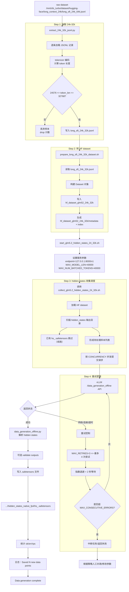

# 24k-32k 数据整理与 hidden-states 收集 Wiki

## 1. 目标
本目录用于整理 24k-32k 长上下文样本与 hidden-states 收集流程，支持后续复用到 32k-64k。

## 2. 目录与文件
- `extract_24k_32k_jsonl.py`
  - 从 `long_sft_24k_64k.jsonl` 按 token 长度提取 24k-32k 区间样本。
- `prepare_long_sft_24k_32k_dataset.sh`
  - 根据 24k-32k 原始 jsonl 转换为 HF dataset 目录。
- `collect_glm5.2_hidden_states_24_32k.sh`
  - 提交 hidden-states 收集任务（离线请求 vLLM）。
- `start_glm5.2_hidden_states_24_32k.sh`
  - 统一启动脚本。

## 3. 已统一的关键约定
- 默认模型上下文保留：
  - `MAX_MODEL_LEN="${MAX_MODEL_LEN:-40000}"
  - `MAX_NUM_BATCHED_TOKENS="${MAX_NUM_BATCHED_TOKENS:-40000}"
- 输出目录约定：
  - `hf_dataset_glm52_24k_32k`

## 4. 主要路径
- 输入源：`/mnt/sfs_turbo/dataset/hugging-face/long_context_24k/long_sft_24k_64k.jsonl`
- 过滤输出：`/mnt/sfs_turbo/dataset/hugging-face/long_context_24k/long_sft_24k_32k.jsonl`
- HF 数据目录：`/mnt/sfs_turbo/dataset/hugging-face/long_context_24k/hf_dataset_glm52_24k_32k`
- hidden-states 输出：`/mnt/sfs_turbo/dataset/hugging-face/long_context_24k/hf_dataset_glm52_24k_32k/hidden_states_native_fp4`

## 5. 运行流程（推荐）
1. 先生成 24k-32k JSONL
   ```bash
   python extract_24k_32k_jsonl.py --input /mnt/sfs_turbo/dataset/hugging-face/long_context_24k/long_sft_24k_64k.jsonl \
     --output /mnt/sfs_turbo/dataset/hugging-face/long_context_24k/long_sft_24k_32k.jsonl \
     --tokenizer /mnt/paas/GLM-5.2-NVFP4-W4A4-MG39-BNT3/v1 \
     --min-length 24576 --max-length 32768
   ```
2. 转 HF dataset
   ```bash
   bash prepare_long_sft_24k_32k_dataset.sh
   ```
3. 启动 vLLM（已在外部启动好模型服务）
4. 收集 hidden-states
   ```bash
   CONCURRENCY=2 MAX_RETRIES=3 MAX_CONSECUTIVE_ERRORS=10 bash collect_glm5.2_hidden_states_24_32k.sh <MAX_SAMPLES>
   ```

## 6. 经验与排障
- 日志出现 `Connection error` 且最终 `err=0`、`Saved xx new data points` 一般是连接抖动重试后成功，不代表最终失败。
- 常见优化：
  - 固定本地请求直连：`NO_PROXY=127.0.0.1,localhost`
  - 视资源调整并发（如 `CONCURRENCY=2`）
  - 适当提高重试上限（如 `MAX_RETRIES=8`, `MAX_CONSECUTIVE_ERRORS=20`）

## 7. 更详细数据流图（Mermaid）



## 8. Git 提交流程（当前提交分支）
- 分支：`feat/collect-hidden-states-24k-32k`
- 提交：`97e8811`
- 仓库：`https://github.com/nanxingMy/speculators_hw.git`
